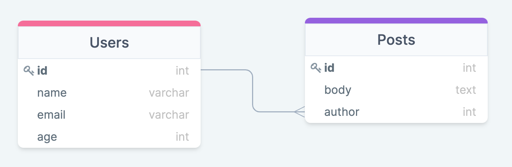

# Sequelize intro

## Как начать работу

1. `npm init -y` или `npm init @elbrus/config` - инициализировать проект node
2. `npm i sequelize pg pg-hstore` - установить зависимости
3. `npm i -D sequelize-cli` - установить sequelize cli
4. создать файл `.sequelizerc`:

```js
const path = require('path');
module.exports = {
  config: path.resolve('db', 'config.json'),
  'models-path': path.resolve('db', 'models'),
  'seeders-path': path.resolve('db', 'seeders'),
  'migrations-path': path.resolve('db', 'migrations'),
};
```

5. `npx sequelize-cli init` - создать структуру для работы с sequelize
6. В файле `config.json` изменить данные для БД (username, password, database, dialect) на
   свои. Можно использовать разные данные для `development` и `test`
7. Для того, чтобы sequelize следил за `seeders` (не накатывались те сидеры, которые уже
   были добавлены в БД, аналогично миграциям), в файл `config.json` добавить строчки

```
"seederStorage": "sequelize",
"seederStorageTableName": "SequelizeData"
```

8. Чтобы убрать из консоли логгирование каждого запроса, можно добавить в `config.json`

```
"logging": false
```

## Модели и миграции

1.  Создать модель командой (изменить под свои задачи)

```
npx sequelize-cli model:generate --name User --attributes firstName:string,lastName:string,email:string
```

- Одновременно с этим создалась миграция
- **Если поменяли что-то в модели - меняем и в миграции**

2.  Накатить миграцию `npx sequelize-cli db:migrate`
3.  Создать seeder командой `npx sequelize-cli seed:generate --name demo-user`
    1.  Когда пишем seeder, поля `createdAt` и `updatedAt` нужно заполнить самому
        `new Date()`

## Связи

**_Важно_**

Если в миграции вы указываете, что какое-то поле _таблицы А_ ссылается на _Таблицу В_, то
на момент накатывания миграции с _Таблицей А_, уже должна существовать _Таблица В_. В
обратном случае, вы получите ошибку `Table_name is not exist`.

  
_Таблица 1_. Связь One-to-Many.

1.  Чтобы создать связь (один ко многим), нужно:

- в модели `Post`:

```js
static associate(models) {
  this.belongsTo(models.User, { foreignKey: 'author' });
}
```

- в модели `User`:

```js
static associate(models) {
  this.hasMany(models.Post, { foreignKey: 'author' });
}
```

- в миграции `create-post`:

```js
author: {
  type: Sequelize.INTEGER,
  allowNull: false,
  references: {
    model: {
      tableName: 'Users',
    },
    key: 'id',
  },
}
```

## Миграция добавления новой колонки

Чтобы добвить новое поле в таблицу, нужно:

1. Создать миграцию командой

```
npx sequelize-cli migration:create --name new_column_in_user
```

2. Изменить миграцию с использованием `queryInterface.addColumn ` и
   `queryInterface.removeColumn`

3. Добавить новое поле в модель `User`
4. Запустить миграцию `npx sequelize-cli db:migrate`

## Many-to-Many (Многие ко многим)

### Идея

В базе данных есть три таблицы: `Posts`, `Tags` и промежуточная таблица `PostsTags`,
которая связывает посты с тегами. Связь между постами и тегами является отношением "многие
ко многим", что позволяет каждому посту иметь множество тегов, а каждому тегу быть
привязанным к множеству постов.

  
_Таблица 1_. Связь "Многие ко многим".

### Модели

1. **Модель `Post`**: Для связи с тегами используется промежуточная таблица `PostsTags`.
   Метод `belongsToMany` указывает, что один пост может быть связан с несколькими тегами
   через эту промежуточную таблицу.

```js
class Post extends Model {
  static associate({ Tag, PostsTag }) {
    this.belongsToMany(Tag, {
      through: PostsTag, // Промежуточная таблица
      foreignKey: 'postId', // Внешний ключ для таблицы Post
      otherKey: 'tagId', // Внешний ключ для таблицы Tag
    });
  }
}
```

2. **Модель `Tag`**: Аналогично, тег может быть связан с множеством постов через
   промежуточную таблицу `PostsTags`.

```js
class Tag extends Model {
  static associate({ Post, PostsTag }) {
    this.belongsToMany(Post, {
      through: PostsTag, // Промежуточная таблица
      foreignKey: 'tagId', // Внешний ключ для таблицы Tag
      otherKey: 'postId', // Внешний ключ для таблицы Post
    });
  }
}
```

3. **Модель `PostsTag`**: В промежуточной модели `PostsTag` можно не добавлять методы или
   дополнительные настройки, так как Sequelize автоматически создаёт необходимую связь
   через метод `belongsToMany`. Однако можно использовать её для добавления дополнительных
   полей, если потребуется.

### Миграции

1. **Миграция `PostsTags`**: В этой миграции создаются два внешних ключа, связывающих
   посты и теги. Оба внешних ключа указывают на таблицы `Posts` и `Tags`, и настроены на
   удаление связанных записей при удалении поста или тега (`onDelete: 'CASCADE'`).

```js
postId: {
  type: Sequelize.INTEGER,
  references: {
    model: 'Posts', // Ссылка на таблицу Posts
    key: 'id',
  },
  allowNull: false,
  onDelete: 'CASCADE', // Автоматическое удаление связанных записей
},
tagId: {
  type: Sequelize.INTEGER,
  references: {
    model: 'Tags', // Ссылка на таблицу Tags
    key: 'id',
  },
  allowNull: false,
  onDelete: 'CASCADE',
},
```

2. **Миграции для `Posts` и `Tags`**: В миграциях для этих таблиц не нужно добавлять
   дополнительных настроек для связи, так как все необходимые связи реализуются через
   промежуточную таблицу `PostsTags`.
