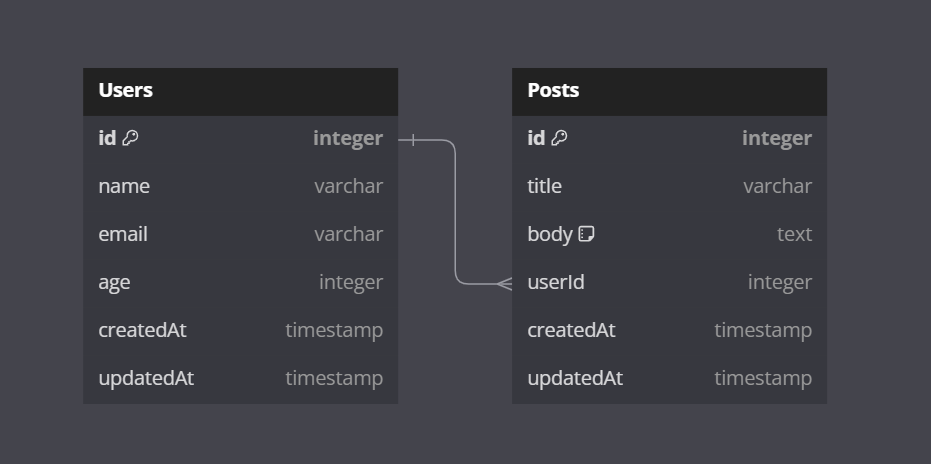
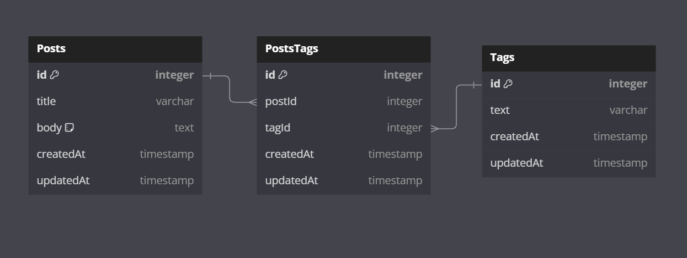

# Гайд по Sequelize

## Как начать работу

1. **Инициализировать проект Node.js**

   Создайте новый проект Node.js с помощью команды:

   ```bash
   npm init -y
   ```

   Либо используйте готовый шаблон конфигурации, если он доступен:

   ```bash
   npm init @elbrus/config
   ```

2. **Установка зависимостей Sequelize и PostgreSQL**

   Установите основные зависимости:

   ```bash
   npm install sequelize pg pg-hstore
   ```

3. **Установка Sequelize CLI**

   Для работы с миграциями и моделями установите Sequelize CLI как dev-зависимость:

   ```bash
   npm install --save-dev sequelize-cli
   ```

4. **Настройка `.sequelizerc`**

   Создайте файл `.sequelizerc` в корне проекта для указания путей к папкам конфигураций,
   моделей, миграций и сидеров:

   ```js
   const path = require('path');
   module.exports = {
     config: path.resolve('db', 'database.json'),
     'models-path': path.resolve('db', 'models'),
     'seeders-path': path.resolve('db', 'seeders'),
     'migrations-path': path.resolve('db', 'migrations'),
   };
   ```

5. **Инициализация структуры проекта для Sequelize**

   С помощью команды `sequelize-cli` создайте стандартную структуру каталогов для работы с
   миграциями, моделями и сидерами:

   ```bash
   npx sequelize-cli init
   ```

   Это создаст следующие папки: `models`, `migrations`, `seeders`, а также файл
   конфигурации `database.json`.

6. **Настройка конфигурации базы данных**

   Откройте файл `db/database.json` и обновите его данными для подключения к вашей базе
   данных (имя пользователя, пароль, название базы данных и тип используемой БД):

   ```json
   {
     "development": {
       "username": "your_username",
       "password": "your_password",
       "database": "your_database",
       "host": "127.0.0.1",
       "dialect": "postgres"
     },
     "test": {
       "username": "your_username",
       "password": "your_password",
       "database": "your_test_database",
       "host": "127.0.0.1",
       "dialect": "postgres"
     }
   }
   ```

7. **Настройка сидеров**

   Чтобы Sequelize отслеживал, какие сидеры уже были применены, добавьте в конфигурацию
   секцию для сидеров:

   ```json
   "seederStorage": "sequelize",
   "seederStorageTableName": "SequelizeData"
   ```

   Это предотвратит повторное применение тех же самых сидеров.

8. **Отключение логов SQL-запросов**  
   Если вы не хотите видеть логи каждого SQL-запроса в консоли, можете добавить в
   конфигурацию настройку `logging: false`:

   ```json
   "logging": false
   ```

## Модели и миграции

1. **Создание модели и миграции**  
   Для создания новой модели и миграции используйте команду `model:generate` с указанием
   атрибутов:

   ```bash
   npx sequelize-cli model:generate --name User --attributes name:string,age:integer,email:string
   ```

   Это одновременно создаст модель `User` и миграцию для неё.

   **Важно:** Если вы изменяете модель после её создания, не забудьте также обновить
   миграцию вручную, чтобы все изменения были отражены в базе данных.

2. **Применение миграций**

   После создания или изменения миграций выполните команду для их применения:

   ```bash
   npx sequelize-cli db:migrate
   ```

3. **Создание сидера**

   Для добавления данных в базу используйте команду `seed:generate`:

   ```bash
   npx sequelize-cli seed:generate --name demo-user
   ```

   В сидере поля `createdAt` и `updatedAt` нужно заполнить вручную, например:

   ```js
   createdAt: new Date(),
   updatedAt: new Date(),
   ```

## Настройка связей между моделями

### Важно

Когда вы создаёте миграции с внешними ключами, важно следить за порядком их применения.
Если таблица A ссылается на таблицу B, то миграция для таблицы B должна быть выполнена
первой, иначе вы получите ошибку: `Table_name does not exist`.

  
_Таблица 1_. Связь One-to-Many.

### Пример связи "Один ко многим" (One-to-Many)

1. **Модель `Post`**

   В модели `Post` создайте связь с пользователем через внешний ключ `userId`:

   ```js
   class Post extends Model {
     static associate(models) {
       this.belongsTo(models.User, { foreignKey: 'userId' });
     }
   }
   ```

2. **Модель `User`**

   В модели `User` укажите, что один пользователь может иметь много постов:

   ```js
   class User extends Model {
     static associate(models) {
       this.hasMany(models.Post, { foreignKey: 'userId' });
     }
   }
   ```

3. **Миграция для `create-post`**

   В миграции для создания таблицы `Posts` добавьте внешний ключ на пользователя:

   ```js
   userId: {
     type: Sequelize.INTEGER,
     allowNull: false,
     references: {
       model: 'Users', // Ссылка на таблицу Users
       key: 'id',
     },
     onDelete: 'CASCADE', // Удаление всех постов пользователя при его удалении
   },
   ```

Таким образом, связь "один ко многим" будет правильно настроена между пользователями и
постами.

## Миграция добавления новой колонки

Чтобы добвить новое поле в таблицу, нужно:

1. Создать миграцию командой

```
npx sequelize-cli migration:create --name new_column_in_user
```

2. Изменить миграцию с использованием `queryInterface.addColumn ` и
   `queryInterface.removeColumn`

3. Добавить новое поле в модель `User`
4. Запустить миграцию `npx sequelize-cli db:migrate`

## Many-to-Many (Многие ко многим)

### Идея

В базе данных есть три таблицы: `Posts`, `Tags` и промежуточная таблица `PostsTags`,
которая связывает посты с тегами. Связь между постами и тегами является отношением "многие
ко многим", что позволяет каждому посту иметь множество тегов, а каждому тегу быть
привязанным к множеству постов.

  
_Таблица 1_. Связь "Многие ко многим".

### Модели

1. **Модель `Post`**: Для связи с тегами используется промежуточная таблица `PostsTags`.
   Метод `belongsToMany` указывает, что один пост может быть связан с несколькими тегами
   через эту промежуточную таблицу.

```js
class Post extends Model {
  static associate({ Tag, PostsTag }) {
    this.belongsToMany(Tag, {
      through: PostsTag, // Промежуточная таблица
      foreignKey: 'postId', // Внешний ключ для таблицы Post
      otherKey: 'tagId', // Внешний ключ для таблицы Tag
    });
  }
}
```

2. **Модель `Tag`**: Аналогично, тег может быть связан с множеством постов через
   промежуточную таблицу `PostsTags`.

```js
class Tag extends Model {
  static associate({ Post, PostsTag }) {
    this.belongsToMany(Post, {
      through: PostsTag, // Промежуточная таблица
      foreignKey: 'tagId', // Внешний ключ для таблицы Tag
      otherKey: 'postId', // Внешний ключ для таблицы Post
    });
  }
}
```

3. **Модель `PostsTag`**: В промежуточной модели `PostsTag` можно не добавлять методы или
   дополнительные настройки, так как Sequelize автоматически создаёт необходимую связь
   через метод `belongsToMany`. Однако можно использовать её для добавления дополнительных
   полей, если потребуется.

### Миграции

1. **Миграция `PostsTags`**: В этой миграции создаются два внешних ключа, связывающих
   посты и теги. Оба внешних ключа указывают на таблицы `Posts` и `Tags`, и настроены на
   удаление связанных записей при удалении поста или тега (`onDelete: 'CASCADE'`).

```js
postId: {
  type: Sequelize.INTEGER,
  references: {
    model: 'Posts', // Ссылка на таблицу Posts
    key: 'id',
  },
  allowNull: false,
  onDelete: 'CASCADE', // Автоматическое удаление связанных записей
},
tagId: {
  type: Sequelize.INTEGER,
  references: {
    model: 'Tags', // Ссылка на таблицу Tags
    key: 'id',
  },
  allowNull: false,
  onDelete: 'CASCADE',
},
```

2. **Миграции для `Posts` и `Tags`**: В миграциях для этих таблиц не нужно добавлять
   дополнительных настроек для связи, так как все необходимые связи реализуются через
   промежуточную таблицу `PostsTags`.
